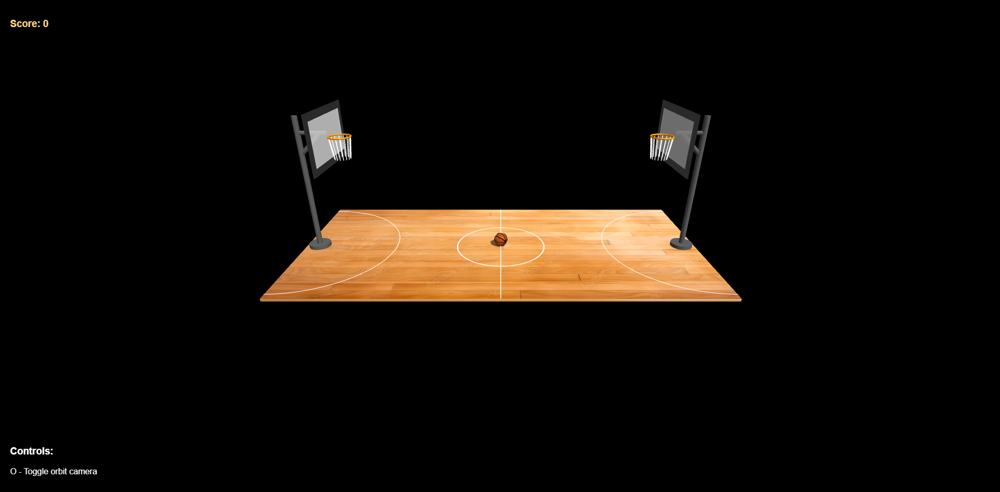
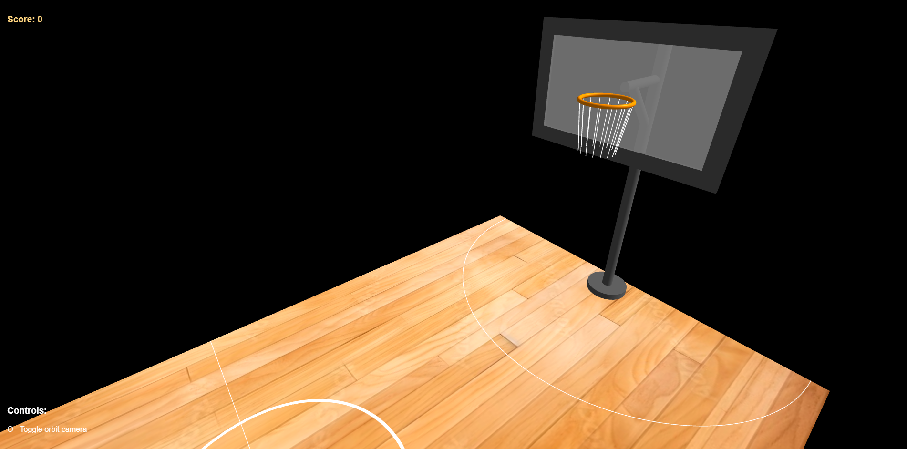
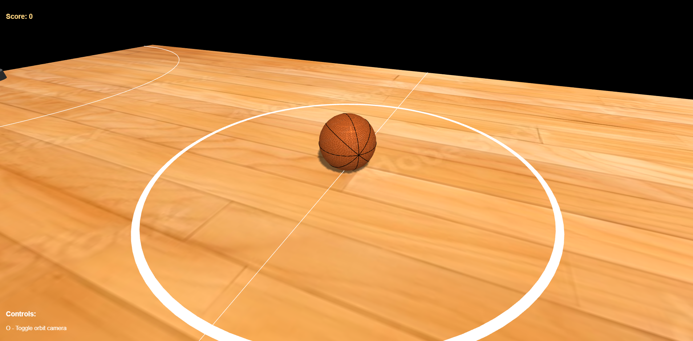
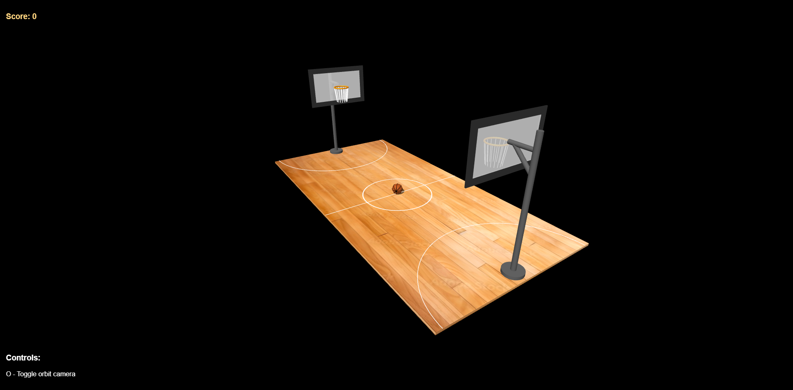
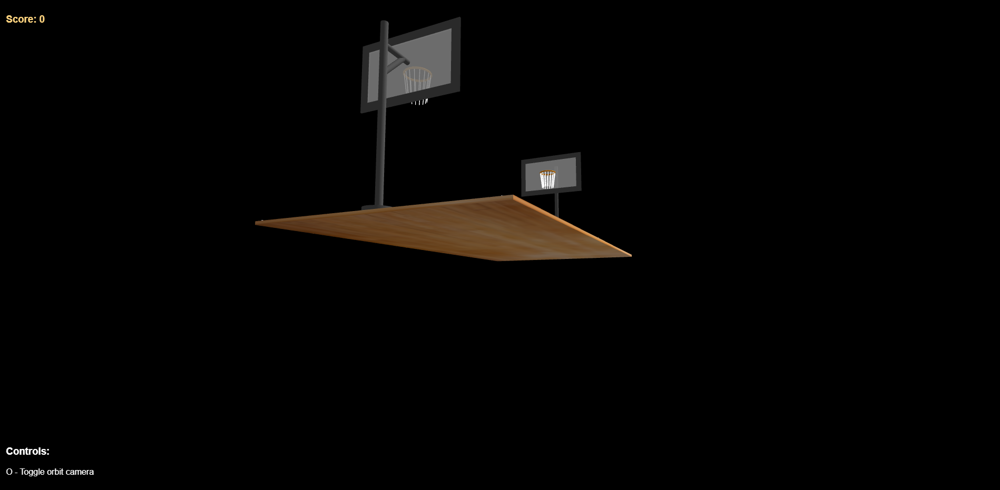
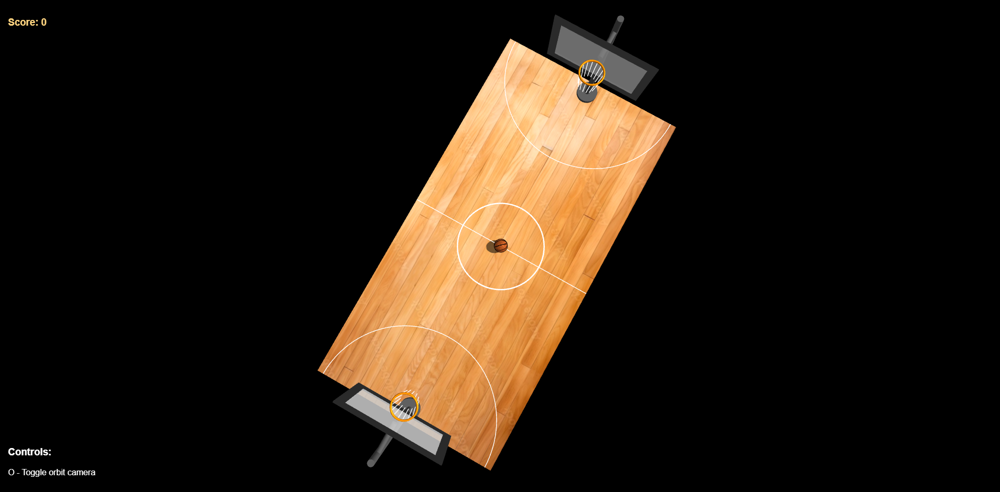
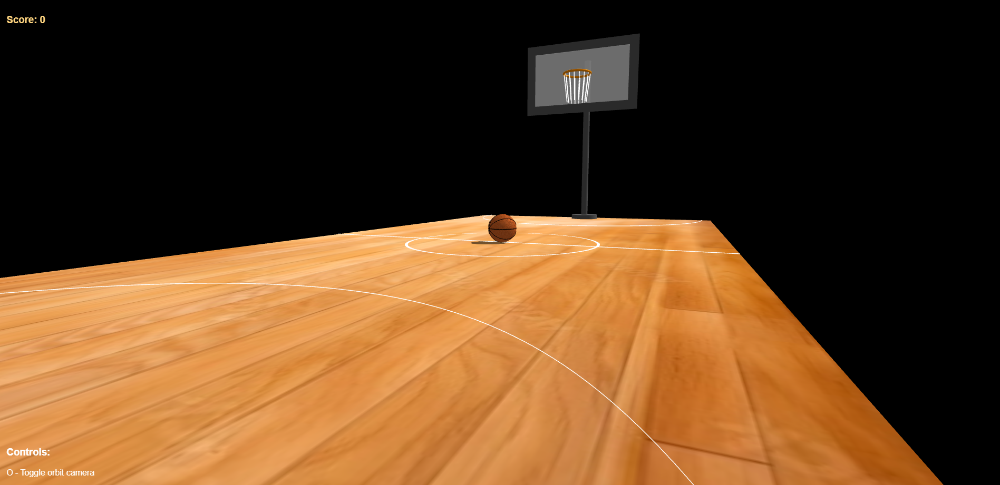
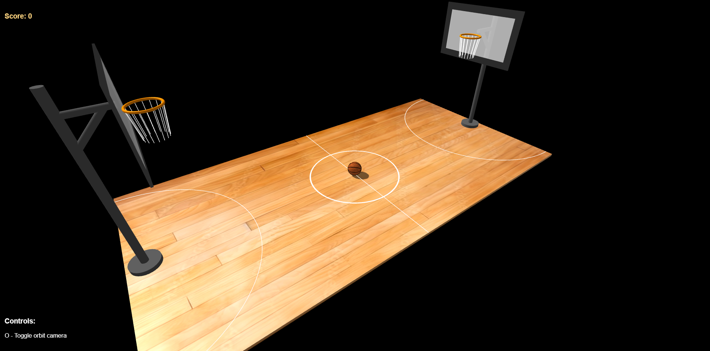

# Computer Graphics - Exercise 5 - WebGL Basketball Court

## Getting Started
1. Clone this repository to your local machine
2. Make sure you have Node.js installed
3. Start the local web server: `node index.js`
4. Open your browser and go to http://localhost:8000

## Complete Instructions
**All detailed instructions, requirements, and specifications can be found in:**
`basketball_exercise_instructions.html`

## Group Members
**MANDATORY: Add the full names of all group members here:**
- Stav Hirszowicz

## Running the implementation
- Run the server with: `node index.js`
- Access at http://localhost:8000 in your web browser

## Implementation:
- No additional features are implemented.
- Issues / limitations:
    - Must run using `node index.js` (as instructed)
    - Because I use external texture (https://piazza.com/class/m8cunlsk2i24ew/post/197),
    src folder must include the following two files (external textures for court and basketball, it is inside this repository):
        - court_texture.jpg
        - texture.jpg

# Screenshots:
## Overall view of the basketball court with hoops

## Close-up view of basketball hoops with nets

## View showing the basketball positioned at center court:

## View demonstrating camera controls functionality

